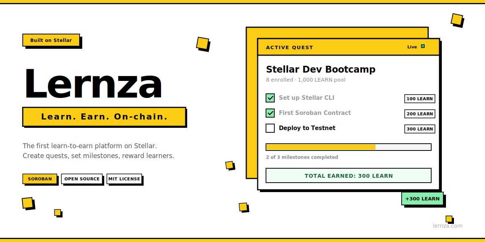

<p align="center">
  <a href="https://lernza.com">
    
  </a>
</p>

<p align="center">
  <strong>Create quests. Set milestones. Reward learners with tokens.</strong><br />
  The first learn-to-earn platform on <a href="https://stellar.org">Stellar</a>.
</p>

<p align="center">
  <a href="https://github.com/lernza/lernza/actions/workflows/ci.yml"></a>
  <a href="https://github.com/lernza/lernza/blob/main/LICENSE"></a>
  <a href="https://stellar.org"></a>
  <a href="https://github.com/lernza/lernza/issues?q=is%3Aissue+is%3Aopen+label%3A%22good+first+issue%22"></a>
</p>

---

> **The idea is simple:** I want to help my brother learn to code. I create a Quest, enroll him, set milestones like "Build your first API" and "Deploy a smart contract," and fund it with tokens. He completes them, gets verified, earns. That's Lernza. Commitment through incentive.

---

## Why Lernza?

Traditional learning platforms rely on willpower alone. Lernza adds **skin in the game** — real financial incentives locked in smart contracts. The creator puts up tokens, the learner earns them by proving they've done the work. No middleman, no trust required, just code.

**Use cases:**
- A company onboarding new devs with milestone-based token rewards
- A DAO funding community education with verifiable outcomes
- A teacher incentivizing students with micro-rewards for each module completed
- A mentor backing a mentee's learning journey with real stakes

---

## How It Works

```
 ┌─────────────┐     ┌──────────────┐     ┌───────────────┐     ┌──────────────┐
 │  1. CREATE   │────▶│  2. FUND     │────▶│  3. LEARN     │────▶│  4. EARN     │
 │  Quest +     │     │  Deposit     │     │  Complete     │     │  Tokens sent │
 │  milestones  │     │  tokens      │     │  milestones   │     │  on-chain    │
 └─────────────┘     └──────────────┘     └───────────────┘     └──────────────┘
      Creator              Creator             Learner            Smart Contract
```

1. **Create** — Define a learning journey with milestones (e.g., "Complete Rust basics", "Build a CLI tool", "Deploy to testnet")
2. **Fund** — Deposit tokens into the quest's reward pool via the rewards contract
3. **Learn** — Enrolled learners work through milestones and submit for verification
4. **Earn** — Once verified, the smart contract automatically distributes the reward

All state lives on-chain. No backend, no database, no middleman.

---

## Tech Stack

| Layer | Technology |
|-------|-----------|
| **Smart Contracts** | [Rust](https://www.rust-lang.org/) + [Soroban SDK](https://soroban.stellar.org) — 3 contracts compiled to WASM |
| **Frontend** | [React 19](https://react.dev/) + [TypeScript 5.9](https://www.typescriptlang.org/) + [Vite 8](https://vite.dev/) |
| **UI** | [shadcn/ui](https://ui.shadcn.com/) + [Tailwind CSS v4](https://tailwindcss.com/) — neo-brutalist design |
| **Wallet** | [Freighter](https://freighter.app/) — Stellar browser wallet |
| **Network** | [Stellar Testnet](https://developers.stellar.org/) — Soroban-enabled |
| **CI** | [GitHub Actions](https://github.com/features/actions) — lint, test, build on every PR |

---

## Architecture

Three independent smart contracts orchestrated by the frontend:

```
┌─────────────────────────────────────────────────────────┐
│                    Frontend (React + Vite)               │
│   Builds transactions → Freighter signs → Stellar RPC   │
└──────────┬──────────────────┬──────────────────┬────────┘
           │                  │                  │
    ┌──────▼──────┐   ┌──────▼──────┐   ┌──────▼──────┐
    │    Quest     │   │  Milestone   │   │   Rewards   │
    │   Contract   │   │  Contract    │   │  Contract   │
    ├─────────────┤   ├─────────────┤   ├─────────────┤
    │ Create quest │   │ Define goals │   │ Fund pool   │
    │ Enroll users │   │ Verify work  │   │ Distribute  │
    │ Manage       │   │ Track        │   │ Track       │
    │  members     │   │  progress    │   │  earnings   │
    └──────┬──────┘   └──────┬──────┘   └──────┬──────┘
           └──────────────────┴──────────────────┘
                     Stellar Blockchain
```

**Why three contracts?** Separation of concerns, independent upgradability, smaller WASM binaries, and clearer security boundaries.

**Why no backend?** The blockchain is the backend. All state lives on Stellar's ledger. Every browser reads from and writes to the same on-chain state via Stellar RPC nodes. Zero infrastructure costs, full transparency.

---

## Smart Contracts

### Quest Contract (`contracts/workspace/`)

> *Being renamed to `contracts/quest/` — see [#1](https://github.com/lernza/lernza/issues/1)*

Manages the core Quest entity and enrollment.

| Function | Description |
|----------|-------------|
| `create_workspace(owner, name, description, token_addr)` | Create a new quest with a reward token |
| `add_enrollee(owner, id, enrollee)` | Enroll a learner (owner only) |
| `remove_enrollee(owner, id, enrollee)` | Remove a learner (owner only) |
| `get_workspace(id)` / `get_enrollees(id)` | Query quest data |
| `is_enrollee(id, user)` | Check enrollment status |

### Milestone Contract (`contracts/milestone/`)

Defines milestones within a quest and tracks completions.

| Function | Description |
|----------|-------------|
| `create_milestone(owner, ws_id, title, desc, reward_amount)` | Add a milestone to a quest |
| `verify_completion(owner, ws_id, ms_id, enrollee)` | Verify a learner completed a milestone |
| `get_milestones(ws_id)` | List all milestones in a quest |
| `is_completed(ws_id, ms_id, enrollee)` | Check completion status |

### Rewards Contract (`contracts/rewards/`)

Manages token pools and distributes rewards using the [Stellar Asset Contract (SAC)](https://soroban.stellar.org/docs/advanced-tutorials/stellar-asset-contract).

| Function | Description |
|----------|-------------|
| `initialize(token_addr)` | Set the reward token (one-time) |
| `fund_workspace(funder, ws_id, amount)` | Deposit tokens into a quest's pool |
| `distribute_reward(authority, ws_id, enrollee, amount)` | Send reward to a learner |
| `get_pool_balance(ws_id)` / `get_user_earnings(user)` | Query balances |

### Contract Patterns

- **Auth:** `address.require_auth()` + storage-based ownership checks
- **Storage:** Instance (counters), Persistent (entities/auth), Temporary (reserved for cooldowns)
- **TTL:** Bump 518,400 ledgers (~30 days), Threshold 120,960 (~7 days)
- **No cross-contract calls** in MVP — the frontend orchestrates the flow

---

## Project Structure

```
lernza/
├── contracts/
│   ├── workspace/          # Quest creation + enrollment (10 tests)
│   ├── milestone/          # Milestone definition + completion (12 tests)
│   └── rewards/            # Token pools + reward distribution (11 tests)
├── frontend/
│   ├── src/
│   │   ├── components/     # shadcn/ui (Button, Card, Badge, Progress) + Navbar
│   │   ├── pages/          # Landing, Dashboard, Workspace detail, Profile
│   │   ├── hooks/          # useWallet (Freighter integration)
│   │   └── lib/            # Utilities + mock data
│   ├── public/             # Logo, favicon, OG image
│   └── index.html
├── .github/
│   ├── workflows/          # CI + Release workflows
│   ├── ISSUE_TEMPLATE/     # Bug report, feature request
│   └── dependabot.yml
├── CONTRIBUTING.md
├── CODE_OF_CONDUCT.md
├── SECURITY.md
└── LICENSE                 # MIT
```

---

## Getting Started

### Prerequisites

| Tool | Version | Install |
|------|---------|---------|
| Rust | Latest stable | [rustup.rs](https://rustup.rs) |
| WASM target | — | `rustup target add wasm32-unknown-unknown` |
| Stellar CLI | 25.x | `brew install stellar-cli` or [docs](https://developers.stellar.org/docs/tools/developer-tools/cli/install-cli) |
| Node.js | 22+ | [nodejs.org](https://nodejs.org) |
| Freighter | Latest | [freighter.app](https://freighter.app) (browser extension) |

### Build & Run

```bash
# Clone
git clone https://github.com/lernza/lernza.git
cd lernza

# Run all 33 contract tests
cargo test --workspace

# Build optimized WASM binaries
stellar contract build

# Run the frontend
cd frontend
npm install --legacy-peer-deps
npm run dev
```

Open [http://localhost:5173](http://localhost:5173), install [Freighter](https://freighter.app), switch to **Testnet**, and connect.

---

## Roadmap

| Milestone | Status | Focus |
|-----------|--------|-------|
| [M1: Quest Foundation](https://github.com/lernza/lernza/milestone/1) | In Progress | Rename workspace → quest, validation, tooling |
| [M2: Quest Engine](https://github.com/lernza/lernza/milestone/2) | Upcoming | Visibility, deadlines, funding models |
| [M3: Neo-Brutalism UI](https://github.com/lernza/lernza/milestone/3) | Upcoming | Design system, component redesign, routing |
| [M4: Full Stack Integration](https://github.com/lernza/lernza/milestone/4) | Upcoming | Wire frontend to contracts |
| [M5: Quality & Advanced](https://github.com/lernza/lernza/milestone/5) | Upcoming | Security audit, docs, advanced features |

See the full [project board](https://github.com/orgs/lernza/projects/1) for all 64 issues.

---

## Contributing

We'd love your help — whether it's fixing a bug, building a feature, or improving docs.

1. Check out the [good first issues](https://github.com/lernza/lernza/issues?q=is%3Aissue+is%3Aopen+label%3A%22good+first+issue%22)
2. Read [CONTRIBUTING.md](CONTRIBUTING.md) for conventions and guidelines
3. Pick an issue, comment that you're on it, and open a PR

**Areas where we need help:** Smart contracts (Rust), Frontend (React/TS), Documentation, Design

See [SECURITY.md](SECURITY.md) for vulnerability disclosure.

---

## Community

- [GitHub Discussions](https://github.com/lernza/lernza/discussions) — questions, ideas, feedback
- [Issues](https://github.com/lernza/lernza/issues) — bug reports and feature requests

---

<p align="center">
  <a href="https://lernza.com">
    
  </a>
</p>

<p align="center">
  <a href="https://github.com/lernza/lernza/blob/main/LICENSE"><strong>MIT License</strong></a> — use it, fork it, build on it.
</p>
