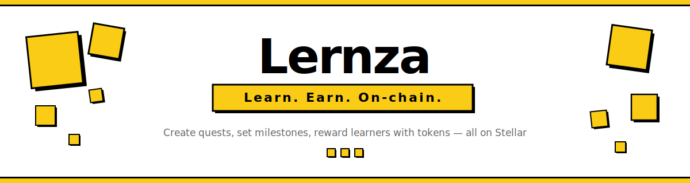
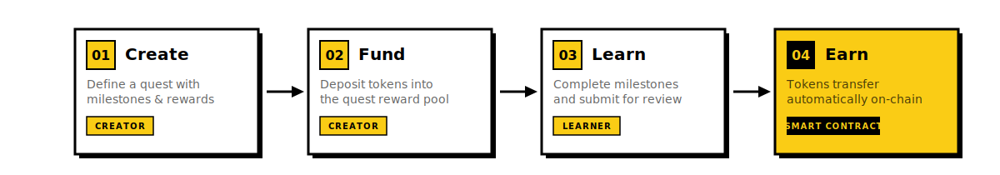
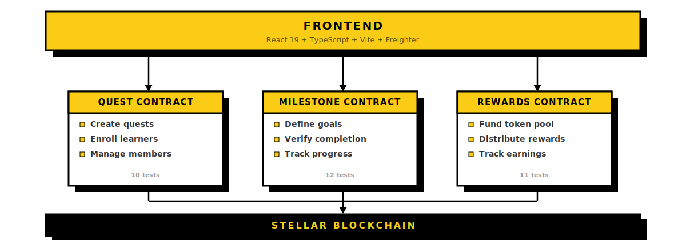

<p align="center">
  <a href="https://lernza.com">
    
  </a>
</p>

<p align="center">
  <a href="https://github.com/lernza/lernza/actions/workflows/ci.yml"></a>
  <a href="https://github.com/lernza/lernza/blob/main/LICENSE"></a>
  <a href="https://stellar.org"></a>
  <a href="https://github.com/lernza/lernza/issues?q=is%3Aissue+is%3Aopen+label%3A%22good+first+issue%22"></a>
</p>

<br />

> **The idea is simple:** I want to help my brother learn to code. I create a Quest, enroll him, set milestones like "Build your first API" and "Deploy a smart contract," and fund it with tokens. He completes them, gets verified, earns. That's Lernza. **Commitment through incentive.**

<br />

## Why Lernza?

Traditional learning platforms rely on willpower alone. Lernza adds **skin in the game** — real financial incentives locked in smart contracts. The creator puts up tokens, the learner earns them by proving they've done the work. No middleman, no trust required, just code.

<table>
<tr>
<td width="50%">

**For companies**
<br/>Onboard new devs with milestone-based token rewards

</td>
<td width="50%">

**For DAOs**
<br/>Fund community education with verifiable outcomes

</td>
</tr>
<tr>
<td width="50%">

**For teachers**
<br/>Incentivize students with micro-rewards per module

</td>
<td width="50%">

**For mentors**
<br/>Back a mentee's learning journey with real stakes

</td>
</tr>
</table>

<br />

## How It Works

<p align="center">
  
</p>

<br />

## Architecture

Three independent Soroban smart contracts orchestrated by the frontend:

<p align="center">
  
</p>

<details>
<summary><strong>Why three contracts?</strong></summary>
<br/>

- **Separation of concerns** — each contract has a single responsibility
- **Independent upgradability** — update rewards logic without touching quest management
- **Smaller WASM binaries** — each stays well under Soroban's 256KB limit
- **Clearer security boundaries** — auth and permissions are scoped per contract

</details>

<details>
<summary><strong>Why no backend?</strong></summary>
<br/>

The blockchain is the backend. All state (quests, enrollments, milestones, rewards) lives on Stellar's ledger. Every user's browser reads from and writes to the same on-chain state via Stellar RPC nodes. Zero infrastructure costs, zero database management, full transparency.

</details>

<br />

## Tech Stack

| Layer | Technology |
|:------|:-----------|
| **Smart Contracts** | Rust + Soroban SDK — 3 contracts compiled to WASM |
| **Frontend** | React 19 + TypeScript 5.9 + Vite 8 |
| **UI** | shadcn/ui + Tailwind CSS v4 — neo-brutalist design system |
| **Wallet** | Freighter — Stellar browser wallet |
| **Network** | Stellar Testnet (Soroban-enabled) |
| **CI** | GitHub Actions — lint, test, build on every PR |

<br />

## Smart Contracts

<details>
<summary><strong>Quest Contract</strong> — <code>contracts/workspace/</code></summary>
<br/>

> *Being renamed to `contracts/quest/` — see [#1](https://github.com/lernza/lernza/issues/1)*

| Function | Description |
|:---------|:------------|
| `create_workspace(owner, name, description, token_addr)` | Create a new quest with a reward token |
| `add_enrollee(owner, id, enrollee)` | Enroll a learner (owner only) |
| `remove_enrollee(owner, id, enrollee)` | Remove a learner (owner only) |
| `get_workspace(id)` / `get_enrollees(id)` | Query quest data |
| `is_enrollee(id, user)` | Check enrollment status |

</details>

<details>
<summary><strong>Milestone Contract</strong> — <code>contracts/milestone/</code></summary>
<br/>

| Function | Description |
|:---------|:------------|
| `create_milestone(owner, ws_id, title, desc, reward_amount)` | Add a milestone to a quest |
| `verify_completion(owner, ws_id, ms_id, enrollee)` | Verify a learner completed a milestone |
| `get_milestones(ws_id)` | List all milestones in a quest |
| `is_completed(ws_id, ms_id, enrollee)` | Check completion status |

</details>

<details>
<summary><strong>Rewards Contract</strong> — <code>contracts/rewards/</code></summary>
<br/>

| Function | Description |
|:---------|:------------|
| `initialize(token_addr)` | Set the reward token (one-time) |
| `fund_workspace(funder, ws_id, amount)` | Deposit tokens into a quest's pool |
| `distribute_reward(authority, ws_id, enrollee, amount)` | Send reward to a learner |
| `get_pool_balance(ws_id)` / `get_user_earnings(user)` | Query balances |

</details>

<details>
<summary><strong>Contract patterns</strong></summary>
<br/>

- **Auth:** `address.require_auth()` + storage-based ownership checks
- **Storage:** Instance (counters), Persistent (entities/auth), Temporary (reserved for cooldowns)
- **TTL:** Bump 518,400 ledgers (~30 days), Threshold 120,960 (~7 days)
- **No cross-contract calls** in MVP — the frontend orchestrates the flow

</details>

<br />

## Project Structure

```
lernza/
├── contracts/
│   ├── workspace/          # Quest creation + enrollment (10 tests)
│   ├── milestone/          # Milestone definition + completion (12 tests)
│   └── rewards/            # Token pools + reward distribution (11 tests)
├── frontend/
│   ├── src/
│   │   ├── components/     # shadcn/ui + Navbar
│   │   ├── pages/          # Landing, Dashboard, Workspace, Profile
│   │   ├── hooks/          # useWallet (Freighter)
│   │   └── lib/            # Utilities + mock data
│   └── public/             # Logo, favicon, OG image
├── .github/
│   ├── workflows/          # CI + Release
│   ├── assets/             # README SVGs
│   └── ISSUE_TEMPLATE/
├── CONTRIBUTING.md
├── SECURITY.md
└── LICENSE                 # MIT
```

<br />

## Getting Started

### Prerequisites

| Tool | Install |
|:-----|:--------|
| **Rust** + WASM target | [rustup.rs](https://rustup.rs) → `rustup target add wasm32-unknown-unknown` |
| **Stellar CLI** 25.x | `brew install stellar-cli` or [docs](https://developers.stellar.org/docs/tools/developer-tools/cli/install-cli) |
| **Node.js** 22+ | [nodejs.org](https://nodejs.org) |
| **Freighter** wallet | [freighter.app](https://freighter.app) (browser extension) |

### Build & Run

```bash
git clone https://github.com/lernza/lernza.git && cd lernza

# Contracts
cargo test --workspace          # 33 tests
stellar contract build          # Optimized WASM

# Frontend
cd frontend
npm install --legacy-peer-deps
npm run dev                     # → http://localhost:5173
```

Install [Freighter](https://freighter.app), switch to **Testnet**, and connect.

<br />

## Roadmap

| Milestone | Status | Focus |
|:----------|:-------|:------|
| **M1** Quest Foundation | In Progress | Rename workspace → quest, validation, tooling |
| **M2** Quest Engine | Upcoming | Visibility, deadlines, funding models |
| **M3** Neo-Brutalism UI | Upcoming | Design system, component redesign, routing |
| **M4** Full Stack Integration | Upcoming | Wire frontend to contracts |
| **M5** Quality & Advanced | Upcoming | Security audit, docs, advanced features |

See the full [project board](https://github.com/orgs/lernza/projects/1) for all 64 issues.

<br />

## Contributing

We'd love your help — whether it's fixing a bug, building a feature, or improving docs.

1. Check out the [good first issues](https://github.com/lernza/lernza/issues?q=is%3Aissue+is%3Aopen+label%3A%22good+first+issue%22)
2. Read [CONTRIBUTING.md](CONTRIBUTING.md) for conventions and guidelines
3. Pick an issue, comment that you're on it, and open a PR

See [SECURITY.md](SECURITY.md) for vulnerability disclosure.

<br />

---

<p align="center">
  <sub><strong>Commitment through incentive.</strong></sub>
</p>
