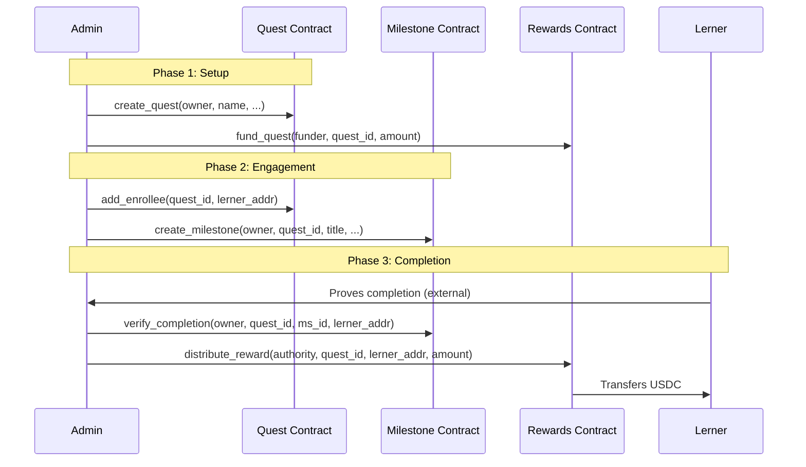

<p align="center">
  <a href="https://lernza.com">
    
  </a>
</p>

<p align="center">
  <a href="https://github.com/lernza/lernza"></a>&nbsp;
  <a href="https://stellar.org"></a>&nbsp;
  <a href="https://github.com/lernza/lernza/issues?q=is%3Aissue+is%3Aopen+label%3A%22good+first+issue%22"></a>&nbsp;
  <a href="https://github.com/lernza/lernza/blob/main/LICENSE"></a>&nbsp;
  <a href="https://codecov.io/gh/lernza/lernza"></a>
</p>

> **The idea is simple:** I want to help my brother learn to code. I create a Quest, enroll him, set milestones like "Build your first API" and "Deploy a smart contract," and fund it with tokens. He completes them, gets verified, earns. That's Lernza. **Commitment through incentive.**

## Why Lernza?

Traditional learning platforms rely on willpower alone. Lernza adds **skin in the game** — real financial incentives locked in smart contracts. The creator puts up tokens, the learner earns them by proving they've done the work. No middleman, no trust required, just code.

<table width="100%">
  <tr>
    <td width="50%">
      <strong>For companies</strong>
      <br/>
      Onboard new devs with milestone-based token rewards
    </td>
    <td width="50%">
      <strong>For DAOs</strong>
      <br/>
      Fund community education with verifiable outcomes
    </td>
  </tr>
  <tr>
    <td width="50%">
      <strong>For teachers</strong>
      <br/>
      Incentivize students with micro-rewards per module
    </td>
    <td width="50%">
      <strong>For mentors</strong>
      <br/>
      Back a mentee's learning journey with real stakes
    </td>
  </tr>
</table>

<br />

## How It Works

<p align="center">
  
</p>

<br />

## Getting Started

```bash
git clone https://github.com/lernza/lernza.git
cd lernza

# Smart contracts
cargo test --workspace      # run the current contract workspace test suite
stellar contract build      # Optimized WASM

# Frontend
cd frontend
pnpm install
pnpm dev                    # → localhost:5173
```

Install [Freighter](https://freighter.app), switch to **Testnet**, and connect.

For contract deployment to Stellar testnet, see [docs/deploy-testnet.md](docs/deploy-testnet.md).

### Current Delivery Stage

Lernza is currently a **contract-first project with a partially wired frontend**.

- The Soroban contracts are implemented and tested in the Rust workspace.
- The frontend has working wallet flows and selected read paths, but several write flows are still simulated in the UI.
- Profile earnings now read the aggregate on-chain total from the rewards contract, but detailed payout history is not indexable yet.

<br />

## Roadmap

| Milestone                     | Status      | Focus                                         |
| :---------------------------- | :---------- | :-------------------------------------------- |
| **M1** Quest Foundation       | In Repo     | Core contract structure, validation, tooling  |
| **M2** Quest Engine           | In Progress | Deadlines live, visibility is discovery-only, funding models still pending |
| **M3** Neo-Brutalism UI       | In Repo     | Frontend screens and design system prototype  |
| **M4** Full Stack Integration | Partial     | Wallet connected, some contract reads wired, several flows still mocked |
| **M5** Quality & Advanced     | Planned     | Security audit, indexing, advanced features   |

See the full [project board](https://github.com/orgs/lernza/projects/1) for all 64 issues.

<br />

## Dive Deeper

<details>
<summary><strong>Architecture</strong></summary>
<br/>

Three independent Soroban smart contracts orchestrated by the frontend:



<p align="center">
  
</p>

Need the transaction-by-transaction flow? See the [contract interaction diagrams](docs/contract-interaction-diagrams.md) for quest creation, enrollment, funding, and reward distribution sequences rendered with GitHub-native Mermaid.

**Why three contracts?**

- **Separation of concerns** — each contract has a single responsibility
- **Independent upgradability** — update rewards logic without touching quest management
- **Smaller WASM binaries** — each stays well under Soroban's 256KB limit
- **Clearer security boundaries** — auth and permissions are scoped per contract

**Why no backend?**
The blockchain IS the backend. All state lives on Stellar's ledger. Zero infrastructure costs, zero database management, full transparency.

**Integration Status**

| Area                    | Status                  | Contract Method     |
| :---------------------- | :---------------------- | :------------------ |
| **Quest Creation**      | Frontend flow still simulated | `create_quest`      |
| **Enrollment**          | Contract available, UI orchestration still incomplete | `add_enrollee`      |
| **Milestone Track**     | Contract available, UI still partly mock-backed | `create_milestone`  |
| **Verification**        | Contract available, not fully wired in UI | `verify_completion` |
| **Reward Distribution** | Contract available, not fully wired in UI | `distribute_reward` |
| **Profile & Analytics** | Aggregate earnings wired; detailed history still unavailable | `get_user_earnings` |

**Privacy model**

`Visibility::Private` is currently **not a confidentiality feature**. It only removes a quest from public discovery helpers such as `list_public_quests`. If a caller knows a quest id, on-chain reads like `get_quest`, `get_enrollees`, and `is_enrollee` remain queryable.

</details>

<details>
<summary><strong>Tech Stack</strong></summary>
<br/>

| Layer               | Technology                                                |
| :------------------ | :-------------------------------------------------------- |
| **Smart Contracts** | Rust + Soroban SDK — 3 contracts compiled to WASM         |
| **Frontend**        | React 19 + TypeScript 5.9 + Vite 8                        |
| **UI**              | shadcn/ui + Tailwind CSS v4 — neo-brutalist design system |
| **Wallet**          | Freighter — Stellar browser wallet                        |
| **Network**         | Stellar Testnet (Soroban-enabled)                         |
| **CI**              | GitHub Actions — lint, test, build on every PR            |

</details>

<details>
<summary><strong>Smart Contracts</strong></summary>
<br/>

**Quest Contract** — `contracts/quest/`

| Function                                                                                         | Description                            |
| :----------------------------------------------------------------------------------------------- | :------------------------------------- |
| `create_quest(owner, name, description, token_addr, visibility, category, tags, enrollment_cap)` | Create a new quest with a reward token |
| `add_enrollee(quest_id, enrollee)`                                                               | Enroll a learner (owner only)          |
| `remove_enrollee(quest_id, enrollee)`                                                            | Remove a learner (owner only)          |
| `get_quest(quest_id)` / `get_enrollees(quest_id)`                                                | Query quest data by id (including quests marked `Private`) |
| `is_enrollee(quest_id, user)`                                                                    | Check enrollment status                |
| `archive_quest(quest_id)`                                                                        | Archive a quest (owner only)           |
| `set_visibility(quest_id, visibility)`                                                           | Update public discovery visibility (not confidentiality) |
| `list_public_quests(start, limit)`                                                               | List public quests with pagination     |

**Milestone Contract** — `contracts/milestone/`

| Function                                                         | Description                                                   |
| :--------------------------------------------------------------- | :------------------------------------------------------------ |
| `initialize(admin, quest_contract, certificate_contract)`        | Initialize milestone contract (one-time)                      |
| `create_milestone(owner, quest_id, title, desc, reward_amount)`  | Add a milestone to a quest                                    |
| `verify_completion(owner, quest_id, milestone_id, enrollee)`     | Verify a learner completed a milestone                        |
| `submit_for_review(enrollee, quest_id, milestone_id, proof_url)` | Submit milestone for review                                   |
| `approve_completion(owner, quest_id, milestone_id, enrollee)`    | Approve a submitted milestone                                 |
| `get_milestones(quest_id)`                                       | List all milestones in a quest                                |
| `is_completed(quest_id, milestone_id, enrollee)`                 | Check completion status                                       |
| `set_verification_mode(owner, quest_id, mode)`                   | Set verification mode (OwnerOnly/SelfVerify/SubmitAndApprove) |
| `set_distribution_mode(owner, quest_id, milestone_id, mode)`     | Set reward distribution mode (Flat/Competitive/Custom)        |

**Rewards Contract** — `contracts/rewards/`

| Function                                                            | Description                                            |
| :------------------------------------------------------------------ | :----------------------------------------------------- |
| `initialize(admin, token_addr, quest_contract, milestone_contract)` | Set the reward token and contract addresses (one-time) |
| `fund_quest(funder, quest_id, amount)`                              | Deposit tokens into a quest's pool                     |
| `distribute_reward(authority, quest_id, enrollee, amount)`          | Send reward to a learner                               |
| `get_pool_balance(quest_id)`                                        | Get quest pool balance                                 |
| `get_user_earnings(user)`                                           | Get total earnings for a user                          |
| `get_total_distributed()`                                           | Get total rewards distributed across all quests        |

**Patterns:**

- **Auth:** `address.require_auth()` + storage-based ownership checks
- **Storage:** Instance (counters), Persistent (entities/auth), Temporary (cooldowns)
- **TTL:** Bump 518,400 ledgers (~30 days), Threshold 120,960 (~7 days)
- **No cross-contract calls** — frontend orchestrates the flow

</details>

<details>
<summary><strong>Project Structure</strong></summary>
<br/>

```
lernza/
├── contracts/
│   ├── quest/              # Quest creation + enrollment
│   ├── milestone/          # Milestone definition + completion
│   ├── rewards/            # Token pools + reward distribution
│   └── certificate/        # NFT certificates for quest completion
├── frontend/
│   ├── src/
│   │   ├── components/     # shadcn/ui + Navbar
│   │   ├── pages/          # Landing, Dashboard, Quest, Profile
│   │   ├── hooks/          # useWallet (Freighter)
│   │   └── lib/            # Utilities + mock data
│   └── public/             # Logo, favicon, OG image
├── .github/
│   ├── workflows/          # CI + Release
│   ├── assets/             # README SVGs
│   └── ISSUE_TEMPLATE/
├── CONTRIBUTING.md
├── SECURITY.md
└── LICENSE                 # MIT
```

</details>

<details>
<summary><strong>Prerequisites</strong></summary>
<br/>

| Tool                   | Install                                                                                                         |
| :--------------------- | :-------------------------------------------------------------------------------------------------------------- |
| **Rust** + WASM target | [rustup.rs](https://rustup.rs) → `rustup target add wasm32-unknown-unknown`                                     |
| **Stellar CLI** 25.x   | `brew install stellar-cli` or [docs](https://developers.stellar.org/docs/tools/developer-tools/cli/install-cli) |
| **Node.js** 22+        | [nodejs.org](https://nodejs.org)                                                                                |
| **Freighter** wallet   | [freighter.app](https://freighter.app) (browser extension)                                                      |

</details>

<br />

## Contributing

We'd love your help. Here's how to jump in:

1. Browse the [good first issues](https://github.com/lernza/lernza/issues?q=is%3Aissue+is%3Aopen+label%3A%22good+first+issue%22) — they're scoped and ready to pick up
2. Read [CONTRIBUTING.md](CONTRIBUTING.md) for setup and conventions
3. Comment on an issue to claim it, then open a PR

See [SECURITY.md](SECURITY.md) for vulnerability disclosure.

<br />

<p align="center">
  <a href="https://github.com/lernza/lernza">
    
  </a>
</p>

<p align="center">
  <a href="https://github.com/lernza/lernza/stargazers">
    <picture>
      <source media="(prefers-color-scheme: dark)" srcset="https://api.star-history.com/svg?repos=lernza/lernza&type=Date&theme=dark&lernza" />
      <source media="(prefers-color-scheme: light)" srcset="https://api.star-history.com/svg?repos=lernza/lernza&type=Date&lernza" />
      
    </picture>
  </a>
</p>

<br />

<h3 align="center">Contributors</h3>

<p align="center">
  <a href="https://github.com/lernza/lernza/graphs/contributors">
    
  </a>
</p>

<br />

---

<p align="center">
  <sub><strong>Commitment through incentive.</strong> Licensed under <a href="LICENSE">MIT</a>.</sub>
</p>
