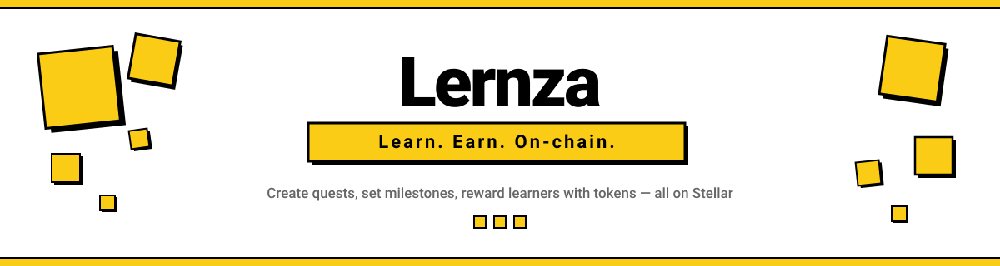
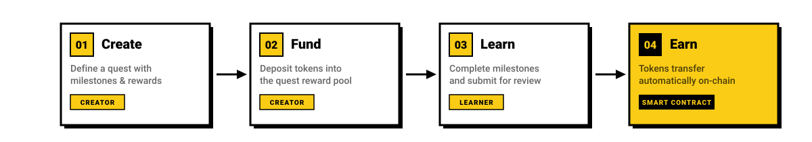
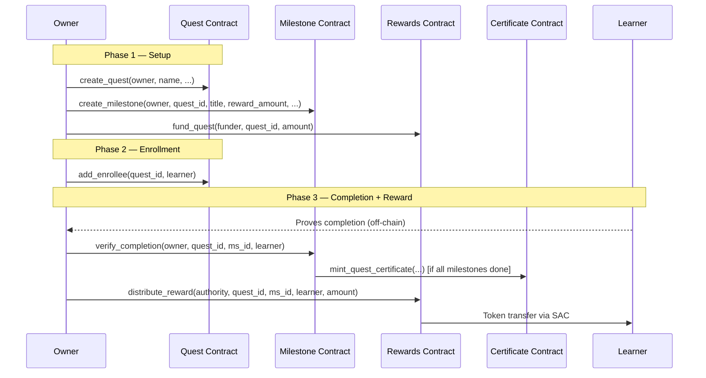
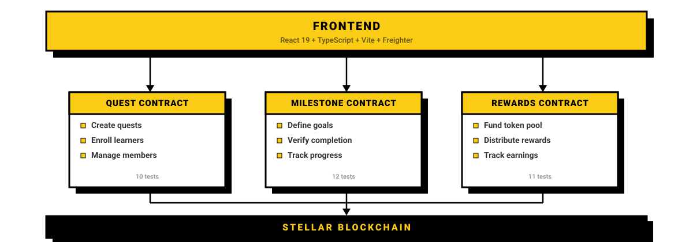

<p align="center">
  <a href="https://lernza.com">
    
  </a>
</p>

<p align="center">
  <a href="https://github.com/lernza/lernza/actions/workflows/ci.yml"></a>&nbsp;
  <a href="https://github.com/lernza/lernza/actions/workflows/pr-checks.yml"></a>&nbsp;
  <a href="https://github.com/lernza/lernza/releases/latest"></a>&nbsp;
  <a href="https://stellar.org"></a>&nbsp;
  <a href="https://github.com/lernza/lernza/blob/main/LICENSE"></a>&nbsp;
  <a href="https://github.com/lernza/lernza/graphs/contributors"></a>&nbsp;
  <a href="https://github.com/lernza/lernza"></a>&nbsp;
  <a href="https://github.com/lernza/lernza/issues?q=is%3Aissue+is%3Aopen+label%3A%22good+first+issue%22"></a>&nbsp;
  <a href="https://codecov.io/gh/lernza/lernza"></a>
</p>

> **The idea is simple:** I want to help my brother learn to code. I create a Quest, enroll him, set milestones like "Build your first API" and "Deploy a smart contract," and fund it with tokens. He completes them, gets verified, earns. That's Lernza. **Commitment through incentive.**

## Why Lernza?

Traditional learning platforms rely on willpower alone. Lernza adds **skin in the game** — real financial incentives locked in smart contracts. The creator puts up tokens, the learner earns them by proving they've done the work. No middleman, no trust required, just code.

<table width="100%">
  <tr>
    <td width="50%">
      <strong>For companies</strong>
      <br/>
      Onboard new devs with milestone-based token rewards
    </td>
    <td width="50%">
      <strong>For DAOs</strong>
      <br/>
      Fund community education with verifiable outcomes
    </td>
  </tr>
  <tr>
    <td width="50%">
      <strong>For teachers</strong>
      <br/>
      Incentivize students with micro-rewards per module
    </td>
    <td width="50%">
      <strong>For mentors</strong>
      <br/>
      Back a mentee's learning journey with real stakes
    </td>
  </tr>
</table>

<br />

## How It Works

<p align="center">
  
</p>

<br />

## Getting Started

The quickest way to get a full development environment is the one-command bootstrap:

```bash
git clone https://github.com/lernza/lernza.git
cd lernza
./scripts/bootstrap.sh   # or: make setup
```

This installs Rust, the WASM target, Stellar CLI, Node.js, pnpm, frontend dependencies, and runs the contract test suite. For a step-by-step walkthrough, see [DEV_SETUP.md](DEV_SETUP.md).

### Manual Setup

```bash
# Smart contracts
cargo test --workspace      # 33 tests
stellar contract build      # Optimized WASM

# Frontend
cd frontend
pnpm install
pnpm dev                    # → localhost:5173
```

Install [Freighter](https://freighter.app), switch to **Testnet**, and connect.

For contract deployment to Stellar testnet, see [docs/deploy-testnet.md](docs/deploy-testnet.md).

<br />

## Roadmap

| Milestone | Status | Focus |
|:----------|:-------|:------|
| **M1** Quest Foundation | In Progress | Rename workspace → quest, validation, tooling |
| **M2** Quest Engine | Upcoming | Visibility, deadlines, funding models |
| **M3** Neo-Brutalism UI | Upcoming | Design system, component redesign, routing |
| **M4** Full Stack Integration | Upcoming | Wire frontend to contracts |
| **M5** Quality & Advanced | Upcoming | Security audit, docs, advanced features |

See the full [project board](https://github.com/orgs/lernza/projects/1) for all 64 issues.

<br />

## Feature Matrix

Know what's real on mainnet day-one vs still simulated:

| Feature | Status | Available | Notes |
|:--------|:-------|:----------|:------|
| **Create Quest** | Production | July 30, 2026 | Full quest setup with title, description, reward token |
| **Enroll Learners** | Production | July 30, 2026 | Add or invite learners to quest |
| **Create Milestones** | Production | July 30, 2026 | Define milestone titles, descriptions, reward amounts |
| **Verify Completion** | Production | July 30, 2026 | Owner/peer review and approve milestone submissions |
| **Distribute Rewards** | Production | July 30, 2026 | Transfer USDC from pool to learner wallet |
| **Leaderboard** | Production | July 30, 2026 | View quest completion rankings and earnings |
| **Certificates (NFT)** | Simulated | TBD | On-chain certificate mints for quest completion |
| **Advanced Analytics** | Simulated | TBD | Detailed learner progress dashboards |
| **Peer Verification** | Simulated | TBD | Community-based milestone approval |

<br />

## Dive Deeper

<details>
<summary><strong>Architecture</strong></summary>
<br/>

Four independent Soroban smart contracts orchestrated by the frontend:


```mermaid
sequenceDiagram
    participant Owner
    participant Quest as Quest Contract
    participant Milestone as Milestone Contract
    participant Rewards as Rewards Contract
    participant Certificate as Certificate Contract
    participant Learner

    Note over Owner,Quest: Phase 1 — Setup
    Owner->>Quest: create_quest(owner, name, ...)
    Owner->>Milestone: create_milestone(owner, quest_id, title, reward_amount, ...)
    Owner->>Rewards: fund_quest(funder, quest_id, amount)

    Note over Owner,Quest: Phase 2 — Enrollment
    Owner->>Quest: add_enrollee(quest_id, learner)

    Note over Owner,Learner: Phase 3 — Completion + Reward
    Learner-->>Owner: Proves completion (off-chain)
    Owner->>Milestone: verify_completion(owner, quest_id, ms_id, learner)
    Milestone->>Certificate: mint_quest_certificate(...) [if all milestones done]
    Owner->>Rewards: distribute_reward(authority, quest_id, ms_id, learner, amount)
    Rewards->>Learner: Token transfer via SAC
```

<p align="center">
  
</p>

For the full transaction-by-transaction breakdown — enrollment variants, peer review, funding, refunds — see [docs/ARCHITECTURE.md](docs/ARCHITECTURE.md). For key architectural decisions and rationale, see the [ADR Index](docs/adr/README.md).


**Why four contracts?**
- **Separation of concerns** — each contract has a single responsibility
- **Independent upgradability** — update rewards logic without touching quest management
- **Smaller WASM binaries** — each stays well under Soroban's 256 KB limit
- **Clearer security boundaries** — auth and permissions are scoped per contract

**Why no backend?**
The blockchain IS the backend. All state lives on Stellar's ledger. Zero infrastructure costs, zero database management, full transparency.

**Integration Status**

| Area | Status | Contract Method |
|:-----|:-------|:----------------|
| **Quest Creation** | Mocked | `create_quest` |
| **Enrollment** | Mocked | `add_enrollee` |
| **Milestone Track** | Mocked | `create_milestone` |
| **Verification** | Mocked | `verify_completion` |
| **Reward Distribution**| Mocked | `distribute_reward` |
| **Profile & Analytics** | Implemented (Mock Data) | `get_user_earnings` |

</details>

<details>
<summary><strong>Tech Stack</strong></summary>
<br/>

| Layer | Technology |
|:------|:-----------|
| **Smart Contracts** | Rust + Soroban SDK — 3 contracts compiled to WASM |
| **Frontend** | React 19 + TypeScript 5.9 + Vite 8 |
| **UI** | shadcn/ui + Tailwind CSS v4 — neo-brutalist design system |
| **Wallet** | Freighter — Stellar browser wallet |
| **Network** | Stellar Testnet (Soroban-enabled) |
| **CI** | GitHub Actions — lint, test, build on every PR |

</details>

<details>
<summary><strong>Smart Contracts</strong></summary>
<br/>

**Quest Contract** — `contracts/quest/`

| Function | Description |
|:---------|:------------|
| `create_quest(owner, name, description, token_addr)` | Create a new quest with a reward token |
| `add_enrollee(quest_id, enrollee)` | Enroll a learner (owner only) |
| `remove_enrollee(quest_id, enrollee)` | Remove a learner (owner only) |
| `get_quest(quest_id)` / `get_enrollees(quest_id)` | Query quest data |
| `is_enrollee(quest_id, user)` | Check enrollment status |

**Milestone Contract** — `contracts/milestone/`

| Function | Description |
|:---------|:------------|
| `create_milestone(owner, quest_id, title, desc, reward_amount)` | Add a milestone to a quest |
| `verify_completion(owner, quest_id, ms_id, enrollee)` | Verify a learner completed a milestone |
| `get_milestones(quest_id)` | List all milestones in a quest |
| `is_completed(quest_id, ms_id, enrollee)` | Check completion status |

**Rewards Contract** — `contracts/rewards/`

| Function | Description |
|:---------|:------------|
| `initialize(token_addr)` | Set the reward token (one-time) |
| `fund_quest(funder, quest_id, amount)` | Deposit tokens into a quest's pool |
| `distribute_reward(authority, quest_id, enrollee, amount)` | Send reward to a learner |
| `get_pool_balance(quest_id)` / `get_user_earnings(user)` | Query balances |

**Patterns:**
- **Auth:** `address.require_auth()` + storage-based ownership checks
- **Storage:** Instance (counters), Persistent (entities/auth), Temporary (cooldowns)
- **TTL:** Bump 518,400 ledgers (~30 days), Threshold 120,960 (~7 days)
- **No cross-contract calls** — frontend orchestrates the flow
- **Gas & Resource Costs:** Detailed execution costs in [docs/GAS_COSTS.md](docs/GAS_COSTS.md)
- **Gas Optimization Report:** [docs/GAS_OPTIMIZATION_REPORT.md](docs/GAS_OPTIMIZATION_REPORT.md)

</details>

<details>
<summary><strong>Project Structure</strong></summary>
<br/>

```
lernza/
├── contracts/
│   ├── quest/              # Quest creation + enrollment (10 tests)
│   ├── milestone/          # Milestone definition + completion (12 tests)
│   └── rewards/            # Token pools + reward distribution (11 tests)
├── frontend/
│   ├── src/
│   │   ├── components/     # shadcn/ui + Navbar
│   │   ├── pages/          # Landing, Dashboard, Quest, Profile
│   │   ├── hooks/          # useWallet (Freighter)
│   │   └── lib/            # Utilities + mock data
│   └── public/             # Logo, favicon, OG image
├── .github/
│   ├── workflows/          # CI + Release
│   ├── assets/             # README SVGs
│   └── ISSUE_TEMPLATE/
├── CONTRIBUTING.md
├── SECURITY.md
└── LICENSE                 # MIT
```

</details>

<details>
<summary><strong>Prerequisites</strong></summary>
<br/>

| Tool | Install |
|:-----|:--------|
| **Rust** + WASM target | [rustup.rs](https://rustup.rs) → `rustup target add wasm32-unknown-unknown` |
| **Stellar CLI** 25.x | `brew install stellar-cli` or [docs](https://developers.stellar.org/docs/tools/developer-tools/cli/install-cli) |
| **Node.js** 22+ | [nodejs.org](https://nodejs.org) |
| **Freighter** wallet | [freighter.app](https://freighter.app) (browser extension) |

</details>

<br />

## Contributing

We'd love your help. Here's how to jump in:

1. Browse the [good first issues](https://github.com/lernza/lernza/issues?q=is%3Aissue+is%3Aopen+label%3A%22good+first+issue%22) — they're scoped and ready to pick up
2. Read [CONTRIBUTING.md](CONTRIBUTING.md) for setup and conventions
3. Comment on an issue to claim it, then open a PR

See [SECURITY.md](SECURITY.md) for vulnerability disclosure.

<br />

<p align="center">
  <a href="https://github.com/lernza/lernza">
    
  </a>
</p>

<p align="center">
  <a href="https://github.com/lernza/lernza/stargazers">
    <picture>
      <source media="(prefers-color-scheme: dark)" srcset="https://api.star-history.com/svg?repos=lernza/lernza&type=Date&theme=dark&lernza" />
      <source media="(prefers-color-scheme: light)" srcset="https://api.star-history.com/svg?repos=lernza/lernza&type=Date&lernza" />
      
    </picture>
  </a>
</p>

<br />

<h3 align="center">Contributors</h3>

<p align="center">
  <a href="https://github.com/lernza/lernza/graphs/contributors">
    
  </a>
</p>

<br />

---

<p align="center">
  <sub><strong>Commitment through incentive.</strong> Licensed under <a href="LICENSE">MIT</a>.</sub>
</p>
