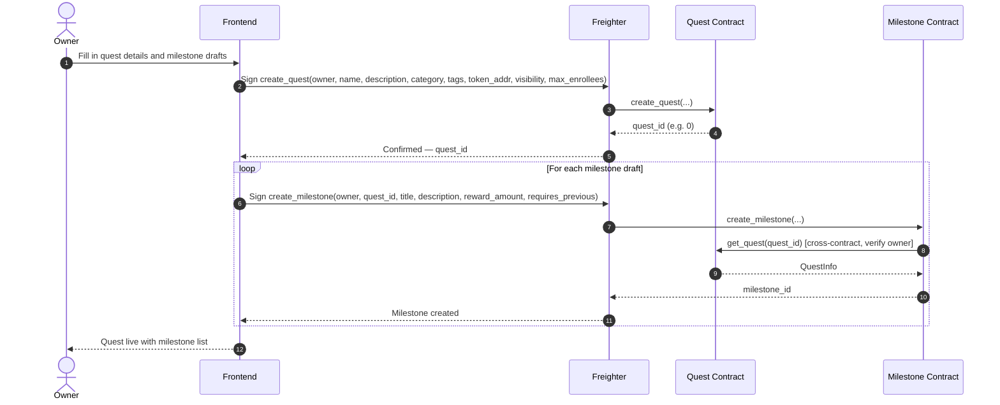
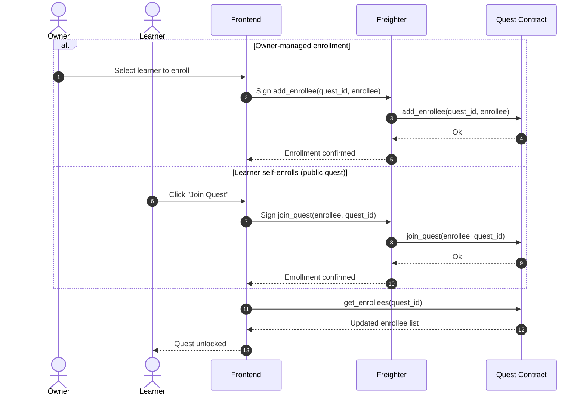
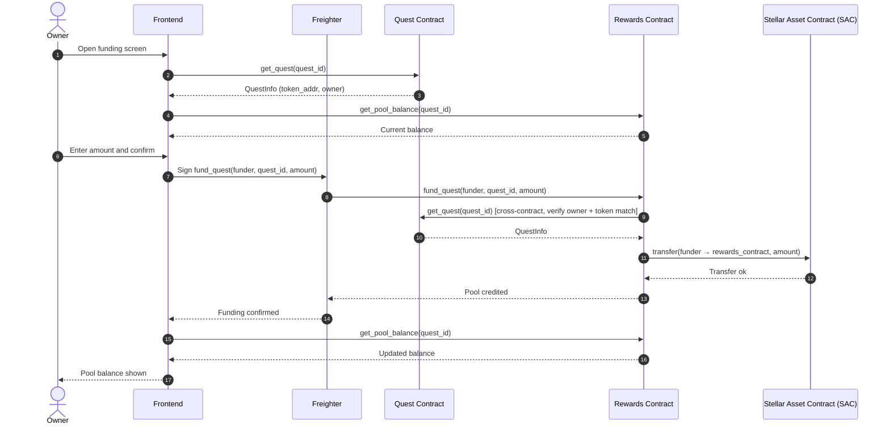
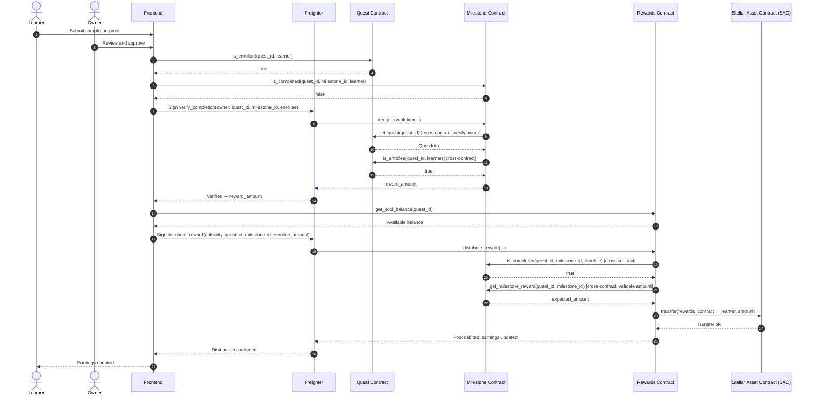
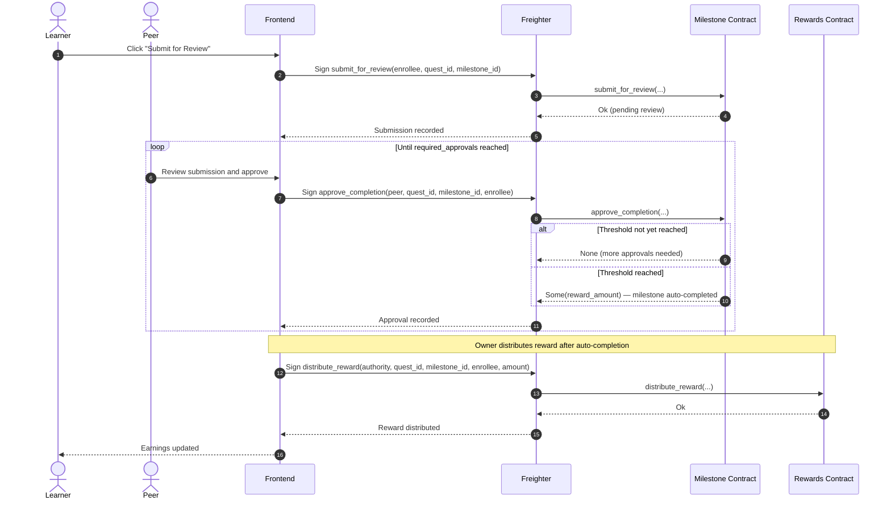
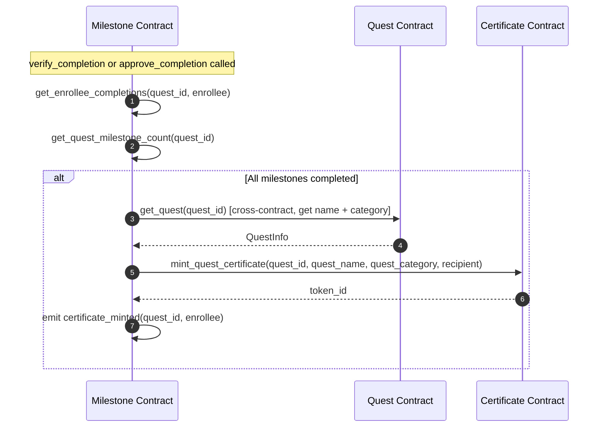
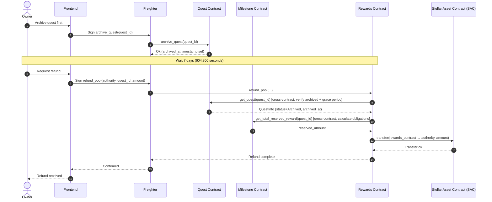

# Architecture

System-level overview of Lernza's four Soroban smart contracts and how the frontend orchestrates them.

## System Overview

Lernza has no backend server. The Stellar blockchain is the backend. All state lives on-chain; the frontend is the orchestration layer that sequences contract calls and presents results to users.

```
┌─────────────────────────────────────────────────────────┐
│                      Frontend (React)                    │
│          Freighter wallet signs every transaction        │
└────────┬──────────┬──────────┬──────────────────────────┘
         │          │          │
    ┌────▼───┐ ┌────▼────┐ ┌──▼──────────┐ ┌─────────────┐
    │ Quest  │ │Milestone│ │   Rewards   │ │ Certificate │
    │Contract│ │Contract │ │  Contract   │ │  Contract   │
    └────────┘ └────┬────┘ └─────────────┘ └─────────────┘
                    │ cross-contract calls (read-only)
                    ▼
              Quest Contract
              Certificate Contract
```

**Why four contracts?**
- Single responsibility per contract — easier to audit and upgrade independently.
- Smaller WASM binaries — each stays well under Soroban's 256 KB limit.
- Scoped auth — permissions are enforced per contract.
- No backend — zero infrastructure cost, full on-chain transparency.

**Cross-contract calls** — The milestone contract calls the quest contract to verify ownership and enrollment, and calls the certificate contract to mint NFTs on quest completion. The rewards contract calls both the quest and milestone contracts to verify ownership and completion before paying out. The frontend does not rely on these cross-contract calls directly; it reads state independently.

---

## Contract Interaction Diagrams

### 1. Quest Creation

The owner creates a quest, then adds milestones. The milestone contract cross-calls the quest contract to verify ownership.



---

### 2. Enrollment

The owner enrolls a learner, or a learner self-enrolls in a public quest.



---

### 3. Quest Funding

The quest owner funds the reward pool. The rewards contract verifies the funder is the quest owner via a cross-contract call, then pulls tokens from the funder's wallet.



---

### 4. Milestone Completion and Reward Distribution (Owner Verification)

The standard flow: owner verifies completion, then distributes the reward. Two separate transactions.



---

### 5. Peer Review Flow

When a quest uses `VerificationMode::PeerReview(n)`, learners submit for review and peers approve.



---

### 6. Certificate Minting (Automatic on Quest Completion)

When a learner completes all milestones, the milestone contract automatically mints an NFT certificate via a cross-contract call.



---

### 7. Pool Refund (After Quest Archival)

The quest authority can reclaim unallocated tokens after a quest is archived and a 7-day grace period has elapsed.



---

## Storage Model

| Contract | Storage Type | What is Stored |
|:---------|:-------------|:---------------|
| Quest | Instance | `NextId`, `Admin`, `Paused` |
| Quest | Persistent | `Quest(id)`, `Enrollees(id)`, `PublicQuests`, `OwnerQuests(addr)`, `EnrolleeQuests(addr)` |
| Milestone | Instance | `Admin`, `Paused`, `QuestContract`, `CertificateContract` |
| Milestone | Persistent | `Milestone(quest,ms)`, `Completed(quest,ms,addr)`, `Mode(quest)`, `VerificationMode(quest)`, earnings, counts |
| Rewards | Instance | `TokenAddr`, `QuestContractAddr`, `MilestoneContractAddr`, `TotalDistributed` |
| Rewards | Persistent | `QuestPool(id)`, `QuestAuthority(id)`, `UserEarnings(addr)`, `PayoutRecord(quest,ms,addr)` |
| Certificate | Instance | NFT collection metadata, owner |
| Certificate | Persistent | `CertificateMetadata(token_id)`, `QuestCertificate(quest,addr)`, `UserCertificates(addr)` |

**TTL policy** — All persistent entries are bumped to 518,400 ledgers (~30 days) on every write, with a refresh threshold of 120,960 ledgers (~7 days). Instance storage is bumped on every state-mutating call.

---

## Privacy Model

`Visibility::Private` is **not a confidentiality feature**. It only removes a quest from public discovery helpers (`list_public_quests`, `get_quests_by_category`). Any caller that knows a quest ID can still read `get_quest`, `get_enrollees`, and `is_enrollee` directly. All on-chain state is public.

---

## Further Reading

- [API Reference](./api-reference.md) — every public function with signatures and error codes
- [Event Reference](./EVENT_REFERENCE.md) — every emitted event with topics and payload
- [Integration Testing](./INTEGRATION_TESTING.md) — local node setup and smoke test walkthrough
- [ADR 002 — Three-contract architecture](./adr/002-three-contract-architecture.md)
- [ADR 003 — Frontend orchestration pattern](./adr/003-frontend-orchestration-pattern.md)
- [ADR 005 — Storage patterns and TTL strategy](./adr/005-storage-patterns-and-ttl-strategy.md)
