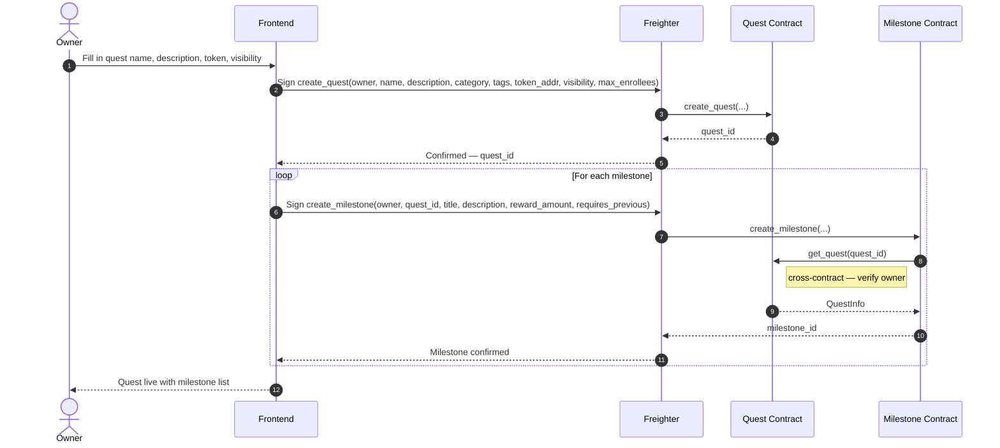
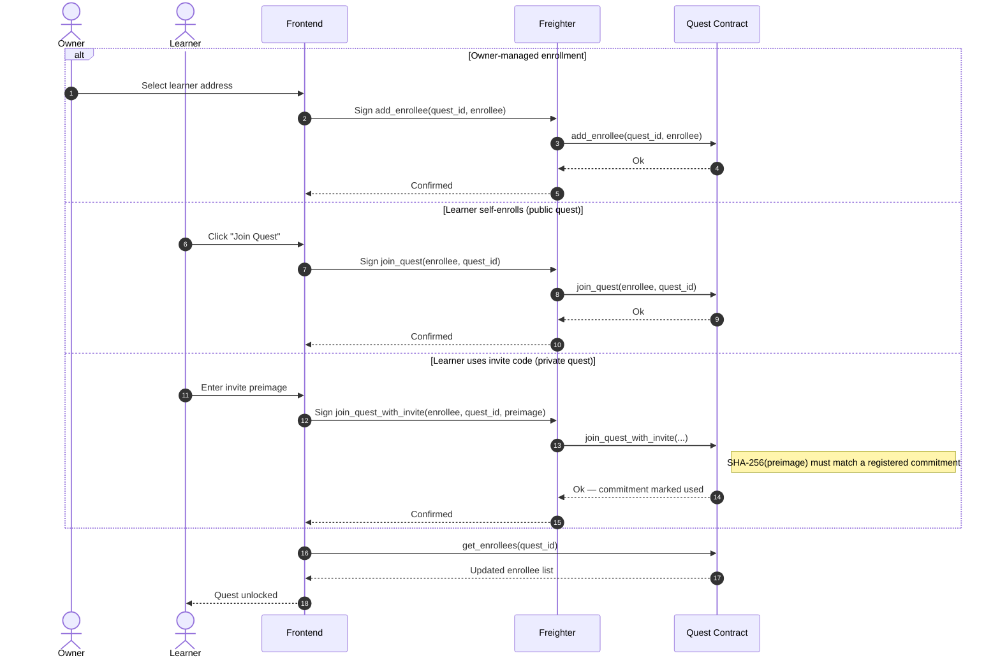
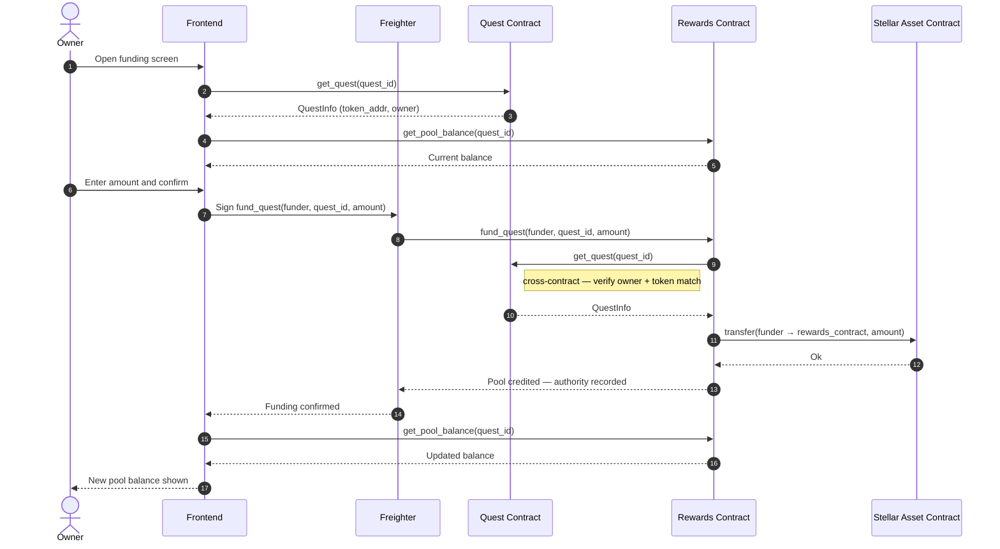
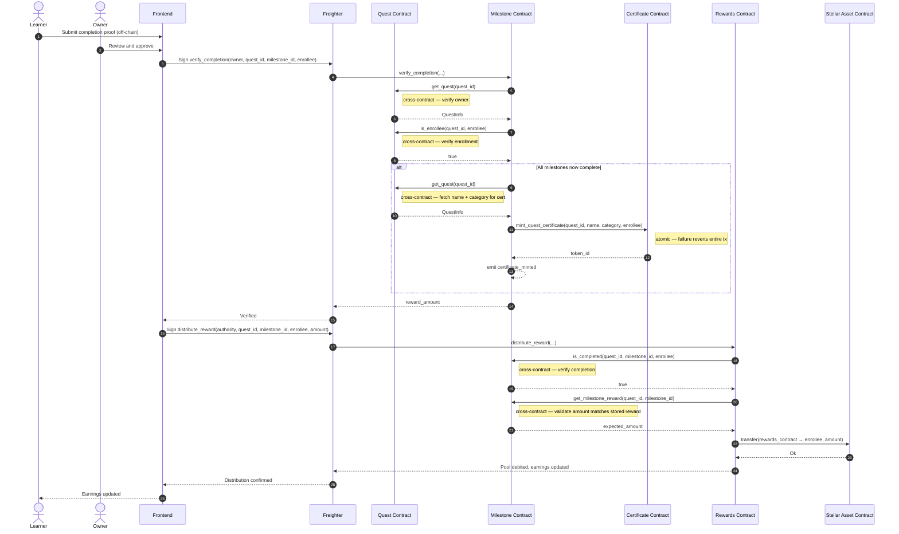
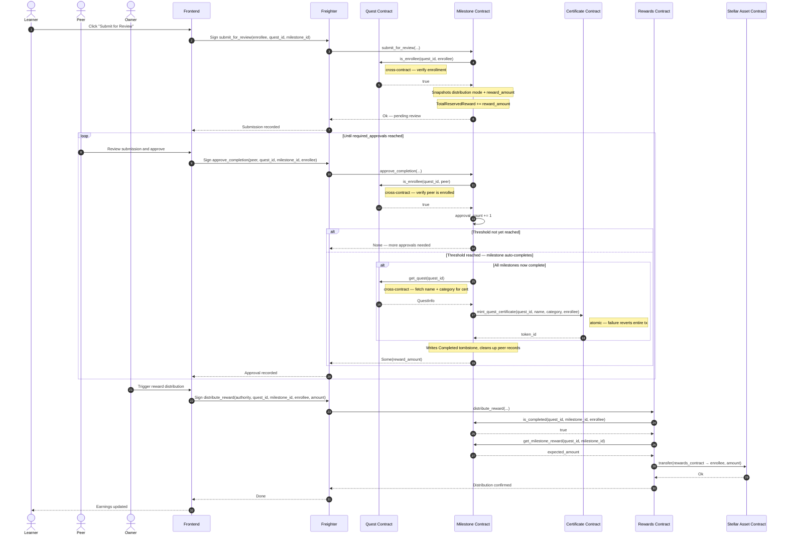
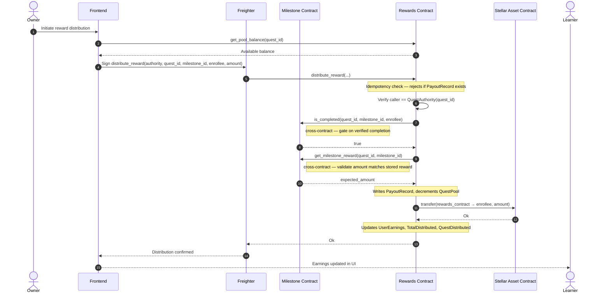
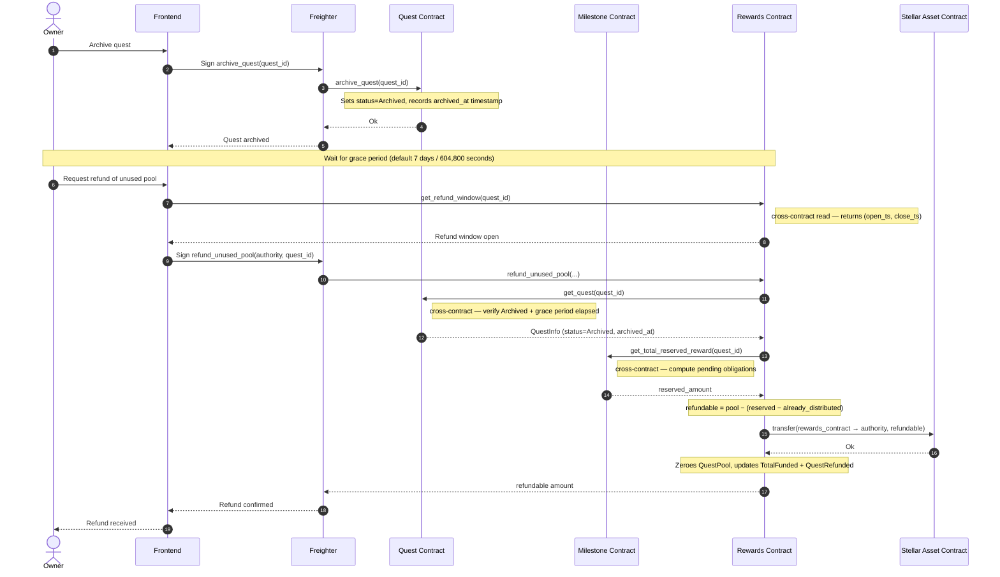

# Architecture

System-level overview of Lernza's four Soroban smart contracts and how the frontend orchestrates them.

## System Overview

Lernza has no backend server. The Stellar blockchain is the backend. All state lives on-chain; the frontend is the orchestration layer that sequences contract calls and presents results to users.

```
┌──────────────────────────────────────────────────────────────────┐
│                         Frontend (React)                          │
│             Freighter wallet signs every transaction              │
└──────┬───────────────┬──────────────┬──────────────┬─────────────┘
       │               │              │              │
  ┌────▼────┐   ┌──────▼──────┐  ┌───▼──────┐  ┌───▼──────────┐
  │  Quest  │   │  Milestone  │  │ Rewards  │  │ Certificate  │
  │Contract │   │  Contract   │  │ Contract │  │  Contract    │
  └─────────┘   └──────┬──────┘  └────┬─────┘  └──────────────┘
                       │ calls        │ calls
              ┌────────┴──────────────┴──────────┐
              │       Quest Contract              │
              │       Certificate Contract        │
              └───────────────────────────────────┘
```

**Why four contracts?**

- Single responsibility per contract — easier to audit and upgrade independently.
- Smaller WASM binaries — each stays well under Soroban's 256 KB limit.
- Scoped auth — permissions are enforced per contract.
- No backend — zero infrastructure cost, full on-chain transparency.

**Cross-contract calls** — Milestone calls Quest (ownership + enrollment checks) and Certificate (NFT mint on quest completion). Rewards calls Quest (ownership + archive checks) and Milestone (completion verification + amount validation). Quest and Certificate make no outbound calls.

---

## Flows

1. [Quest Creation](#1-quest-creation)
2. [Enrollment](#2-enrollment)
3. [Quest Funding](#3-quest-funding)
4. [Milestone Completion — Owner Verification](#4-milestone-completion--owner-verification)
5. [Milestone Completion — Peer Review](#5-milestone-completion--peer-review)
6. [Reward Distribution](#6-reward-distribution)
7. [Pool Refund After Archival](#7-pool-refund-after-archival)

---

## 1. Quest Creation

The owner creates a quest, then defines milestones. Each `create_milestone` call cross-calls the quest contract to verify the caller is the quest owner.


```mermaid
sequenceDiagram
    autonumber
    actor Owner
    participant FE as Frontend
    participant Wallet as Freighter
    participant Quest as Quest Contract
    participant Milestone as Milestone Contract

    Owner->>FE: Fill in quest name, description, token, visibility
    FE->>Wallet: Sign create_quest(owner, name, description, category, tags, token_addr, visibility, max_enrollees)
    Wallet->>Quest: create_quest(...)
    Quest-->>Wallet: quest_id
    Wallet-->>FE: Confirmed — quest_id

    loop For each milestone
        FE->>Wallet: Sign create_milestone(owner, quest_id, title, description, reward_amount, requires_previous)
        Wallet->>Milestone: create_milestone(...)
        Milestone->>Quest: get_quest(quest_id)
        Note right of Quest: cross-contract — verify owner
        Quest-->>Milestone: QuestInfo
        Milestone-->>Wallet: milestone_id
        Wallet-->>FE: Milestone confirmed
    end

    FE-->>Owner: Quest live with milestone list
```

---

## 2. Enrollment

The owner adds a learner directly, or a learner self-enrolls in a public quest. Private quests use a commit-reveal invite scheme.


```mermaid
sequenceDiagram
    autonumber
    actor Owner
    actor Learner
    participant FE as Frontend
    participant Wallet as Freighter
    participant Quest as Quest Contract

    alt Owner-managed enrollment
        Owner->>FE: Select learner address
        FE->>Wallet: Sign add_enrollee(quest_id, enrollee)
        Wallet->>Quest: add_enrollee(quest_id, enrollee)
        Quest-->>Wallet: Ok
        Wallet-->>FE: Confirmed
    else Learner self-enrolls (public quest)
        Learner->>FE: Click "Join Quest"
        FE->>Wallet: Sign join_quest(enrollee, quest_id)
        Wallet->>Quest: join_quest(enrollee, quest_id)
        Quest-->>Wallet: Ok
        Wallet-->>FE: Confirmed
    else Learner uses invite code (private quest)
        Learner->>FE: Enter invite preimage
        FE->>Wallet: Sign join_quest_with_invite(enrollee, quest_id, preimage)
        Wallet->>Quest: join_quest_with_invite(...)
        Note right of Quest: SHA-256(preimage) must match a registered commitment
        Quest-->>Wallet: Ok — commitment marked used
        Wallet-->>FE: Confirmed
    end

    FE->>Quest: get_enrollees(quest_id)
    Quest-->>FE: Updated enrollee list
    FE-->>Learner: Quest unlocked
```

---

## 3. Quest Funding

The owner funds the reward pool. Rewards cross-calls Quest to verify the funder is the quest owner and that the token matches; then pulls tokens via the Stellar Asset Contract.


```mermaid
sequenceDiagram
    autonumber
    actor Owner
    participant FE as Frontend
    participant Wallet as Freighter
    participant Quest as Quest Contract
    participant Rewards as Rewards Contract
    participant SAC as Stellar Asset Contract

    Owner->>FE: Open funding screen
    FE->>Quest: get_quest(quest_id)
    Quest-->>FE: QuestInfo (token_addr, owner)
    FE->>Rewards: get_pool_balance(quest_id)
    Rewards-->>FE: Current balance

    Owner->>FE: Enter amount and confirm
    FE->>Wallet: Sign fund_quest(funder, quest_id, amount)
    Wallet->>Rewards: fund_quest(funder, quest_id, amount)
    Rewards->>Quest: get_quest(quest_id)
    Note right of Quest: cross-contract — verify owner + token match
    Quest-->>Rewards: QuestInfo
    Rewards->>SAC: transfer(funder → rewards_contract, amount)
    SAC-->>Rewards: Ok
    Rewards-->>Wallet: Pool credited — authority recorded
    Wallet-->>FE: Funding confirmed

    FE->>Rewards: get_pool_balance(quest_id)
    Rewards-->>FE: Updated balance
    FE-->>Owner: New pool balance shown
```

---

## 4. Milestone Completion — Owner Verification

The standard path: the owner reviews off-chain proof, calls `verify_completion`, and the frontend then calls `distribute_reward` as a second transaction. If this completion finishes the quest, the milestone contract atomically mints an NFT certificate.


```mermaid
sequenceDiagram
    autonumber
    actor Learner
    actor Owner
    participant FE as Frontend
    participant Wallet as Freighter
    participant Quest as Quest Contract
    participant Milestone as Milestone Contract
    participant Certificate as Certificate Contract
    participant Rewards as Rewards Contract
    participant SAC as Stellar Asset Contract

    Learner->>FE: Submit completion proof (off-chain)
    Owner->>FE: Review and approve

    FE->>Wallet: Sign verify_completion(owner, quest_id, milestone_id, enrollee)
    Wallet->>Milestone: verify_completion(...)
    Milestone->>Quest: get_quest(quest_id)
    Note right of Quest: cross-contract — verify owner
    Quest-->>Milestone: QuestInfo
    Milestone->>Quest: is_enrollee(quest_id, enrollee)
    Note right of Quest: cross-contract — verify enrollment
    Quest-->>Milestone: true

    alt All milestones now complete
        Milestone->>Quest: get_quest(quest_id)
        Note right of Quest: cross-contract — fetch name + category for cert
        Quest-->>Milestone: QuestInfo
        Milestone->>Certificate: mint_quest_certificate(quest_id, name, category, enrollee)
        Note right of Certificate: atomic — failure reverts entire tx
        Certificate-->>Milestone: token_id
        Milestone-->>Milestone: emit certificate_minted
    end

    Milestone-->>Wallet: reward_amount
    Wallet-->>FE: Verified

    FE->>Wallet: Sign distribute_reward(authority, quest_id, milestone_id, enrollee, amount)
    Wallet->>Rewards: distribute_reward(...)
    Rewards->>Milestone: is_completed(quest_id, milestone_id, enrollee)
    Note right of Milestone: cross-contract — verify completion
    Milestone-->>Rewards: true
    Rewards->>Milestone: get_milestone_reward(quest_id, milestone_id)
    Note right of Milestone: cross-contract — validate amount matches stored reward
    Milestone-->>Rewards: expected_amount
    Rewards->>SAC: transfer(rewards_contract → enrollee, amount)
    SAC-->>Rewards: Ok
    Rewards-->>Wallet: Pool debited, earnings updated
    Wallet-->>FE: Distribution confirmed
    FE-->>Learner: Earnings updated
```

---

## 5. Milestone Completion — Peer Review

When the quest uses `VerificationMode::PeerReview(n)`, a learner submits for review and `n` enrolled peers must approve before the milestone auto-completes. Distribution follows separately.


```mermaid
sequenceDiagram
    autonumber
    actor Learner
    actor Peer
    actor Owner
    participant FE as Frontend
    participant Wallet as Freighter
    participant Quest as Quest Contract
    participant Milestone as Milestone Contract
    participant Certificate as Certificate Contract
    participant Rewards as Rewards Contract
    participant SAC as Stellar Asset Contract

    Learner->>FE: Click "Submit for Review"
    FE->>Wallet: Sign submit_for_review(enrollee, quest_id, milestone_id)
    Wallet->>Milestone: submit_for_review(...)
    Milestone->>Quest: is_enrollee(quest_id, enrollee)
    Note right of Quest: cross-contract — verify enrollment
    Quest-->>Milestone: true
    Note over Milestone: Snapshots distribution mode + reward_amount
    Note over Milestone: TotalReservedReward += reward_amount
    Milestone-->>Wallet: Ok — pending review
    Wallet-->>FE: Submission recorded

    loop Until required_approvals reached
        Peer->>FE: Review submission and approve
        FE->>Wallet: Sign approve_completion(peer, quest_id, milestone_id, enrollee)
        Wallet->>Milestone: approve_completion(...)
        Milestone->>Quest: is_enrollee(quest_id, peer)
        Note right of Quest: cross-contract — verify peer is enrolled
        Quest-->>Milestone: true
        Milestone->>Milestone: approval_count += 1

        alt Threshold not yet reached
            Milestone-->>Wallet: None — more approvals needed
        else Threshold reached — milestone auto-completes
            alt All milestones now complete
                Milestone->>Quest: get_quest(quest_id)
                Note right of Quest: cross-contract — fetch name + category for cert
                Quest-->>Milestone: QuestInfo
                Milestone->>Certificate: mint_quest_certificate(quest_id, name, category, enrollee)
                Note right of Certificate: atomic — failure reverts entire tx
                Certificate-->>Milestone: token_id
            end
            Note over Milestone: Writes Completed tombstone, cleans up peer records
            Milestone-->>Wallet: Some(reward_amount)
        end
        Wallet-->>FE: Approval recorded
    end

    Owner->>FE: Trigger reward distribution
    FE->>Wallet: Sign distribute_reward(authority, quest_id, milestone_id, enrollee, amount)
    Wallet->>Rewards: distribute_reward(...)
    Rewards->>Milestone: is_completed(quest_id, milestone_id, enrollee)
    Milestone-->>Rewards: true
    Rewards->>Milestone: get_milestone_reward(quest_id, milestone_id)
    Milestone-->>Rewards: expected_amount
    Rewards->>SAC: transfer(rewards_contract → enrollee, amount)
    SAC-->>Rewards: Ok
    Rewards-->>Wallet: Distribution confirmed
    Wallet-->>FE: Done
    FE-->>Learner: Earnings updated
```

---

## 6. Reward Distribution

`distribute_reward` is a standalone call available after any completion path. It cross-calls Milestone twice (completion check + amount validation) before transferring tokens.


```mermaid
sequenceDiagram
    autonumber
    actor Owner
    participant FE as Frontend
    participant Wallet as Freighter
    participant Milestone as Milestone Contract
    participant Rewards as Rewards Contract
    participant SAC as Stellar Asset Contract
    actor Learner

    Owner->>FE: Initiate reward distribution
    FE->>Rewards: get_pool_balance(quest_id)
    Rewards-->>FE: Available balance

    FE->>Wallet: Sign distribute_reward(authority, quest_id, milestone_id, enrollee, amount)
    Wallet->>Rewards: distribute_reward(...)

    Note over Rewards: Idempotency check — rejects if PayoutRecord exists
    Rewards->>Rewards: Verify caller == QuestAuthority(quest_id)

    Rewards->>Milestone: is_completed(quest_id, milestone_id, enrollee)
    Note right of Milestone: cross-contract — gate on verified completion
    Milestone-->>Rewards: true

    Rewards->>Milestone: get_milestone_reward(quest_id, milestone_id)
    Note right of Milestone: cross-contract — validate amount matches stored reward
    Milestone-->>Rewards: expected_amount

    Note over Rewards: Writes PayoutRecord, decrements QuestPool
    Rewards->>SAC: transfer(rewards_contract → enrollee, amount)
    SAC-->>Rewards: Ok
    Note over Rewards: Updates UserEarnings, TotalDistributed, QuestDistributed

    Rewards-->>Wallet: Ok
    Wallet-->>FE: Distribution confirmed
    FE-->>Learner: Earnings updated in UI
```

---

## 7. Pool Refund After Archival

The quest authority can reclaim unallocated tokens after archiving the quest and waiting the grace period (default 7 days, configurable by admin). Rewards cross-calls both Quest and Milestone to verify the window is open and calculate remaining obligations.


```mermaid
sequenceDiagram
    autonumber
    actor Owner
    participant FE as Frontend
    participant Wallet as Freighter
    participant Quest as Quest Contract
    participant Milestone as Milestone Contract
    participant Rewards as Rewards Contract
    participant SAC as Stellar Asset Contract

    Owner->>FE: Archive quest
    FE->>Wallet: Sign archive_quest(quest_id)
    Wallet->>Quest: archive_quest(quest_id)
    Note over Quest: Sets status=Archived, records archived_at timestamp
    Quest-->>Wallet: Ok
    Wallet-->>FE: Quest archived

    Note over Owner,Rewards: Wait for grace period (default 7 days / 604,800 seconds)

    Owner->>FE: Request refund of unused pool
    FE->>Rewards: get_refund_window(quest_id)
    Note right of Rewards: cross-contract read — returns (open_ts, close_ts)
    Rewards-->>FE: Refund window open

    FE->>Wallet: Sign refund_unused_pool(authority, quest_id)
    Wallet->>Rewards: refund_unused_pool(...)

    Rewards->>Quest: get_quest(quest_id)
    Note right of Quest: cross-contract — verify Archived + grace period elapsed
    Quest-->>Rewards: QuestInfo (status=Archived, archived_at)

    Rewards->>Milestone: get_total_reserved_reward(quest_id)
    Note right of Milestone: cross-contract — compute pending obligations
    Milestone-->>Rewards: reserved_amount

    Note over Rewards: refundable = pool − (reserved − already_distributed)

    Rewards->>SAC: transfer(rewards_contract → authority, refundable)
    SAC-->>Rewards: Ok
    Note over Rewards: Zeroes QuestPool, updates TotalFunded + QuestRefunded

    Rewards-->>Wallet: refundable amount
    Wallet-->>FE: Refund confirmed
    FE-->>Owner: Refund received
```

---

## Storage Summary

| Contract | Storage Type | Key entries |
|:---------|:-------------|:------------|
| Quest | Instance | `NextId`, `Admin`, `Paused` |
| Quest | Persistent | `Quest(id)`, `Enrollees(id)`, `PublicQuests`, `OwnerQuests(addr)`, `EnrolleeQuests(addr)`, `InviteCommitment(id, hash)`, `LeaveHold(id, addr)` |
| Milestone | Instance | `Admin`, `Paused`, `QuestContract`, `CertificateContract` |
| Milestone | Persistent | `Milestone(quest,ms)`, `Completed(quest,ms,addr)`, `Mode(quest)`, `VerificationMode(quest)`, `TotalReservedReward(quest)`, `PendingSubmission(quest,ms,addr)`, earnings + counts |
| Rewards | Instance | `TokenAddr`, `QuestContractAddr`, `MilestoneContractAddr`, `Admin`, `TotalDistributed`, `TotalFunded`, `RefundGracePeriod` |
| Rewards | Persistent | `QuestPool(id)`, `QuestAuthority(id)`, `UserEarnings(addr)`, `PayoutRecord(quest,ms,addr)`, `QuestDistributed(id)`, `QuestRefunded(id)` |
| Certificate | Instance | NFT collection metadata, `Paused` |
| Certificate | Persistent | `CertificateMetadata(token_id)`, `QuestCertificate(quest,addr)`, `UserCertificates(addr)`, `RevokedCertificate(token_id)` |

**TTL policy** — Persistent entries are bumped to 518,400 ledgers (~30 days) on every write, with a refresh threshold of 120,960 ledgers (~7 days). Instance storage is bumped on every state-mutating call.

---

## Cross-Contract Call Graph

```
Frontend
  ├─► Quest            (no outbound calls)
  ├─► Milestone
  │     ├─► Quest.get_quest             (ownership checks, name/category for cert)
  │     ├─► Quest.is_enrollee           (enrollment gate)
  │     ├─► Quest.get_enrollees         (completion rate queries)
  │     └─► Certificate.mint_quest_certificate  (atomic — quest completion only)
  ├─► Rewards
  │     ├─► Quest.get_quest             (ownership check on fund; archive check on refund)
  │     ├─► Milestone.is_completed      (gate before transfer)
  │     ├─► Milestone.get_milestone_reward       (amount validation)
  │     └─► Milestone.get_total_reserved_reward  (obligation check on refund)
  └─► Certificate      (no outbound calls)
```

---

## Privacy Model

`Visibility::Private` is **not a confidentiality feature**. It only removes a quest from public discovery helpers (`list_public_quests`, `get_quests_by_category`). Any caller that knows a quest ID can still read `get_quest`, `get_enrollees`, and `is_enrollee` directly. All on-chain state is public.

---

## Further Reading

- [API Reference](./api-reference.md) — every public function with signatures and error codes
- [Event Reference](./EVENT_REFERENCE.md) — every emitted event with topics and payload
- [Integration Testing](./INTEGRATION_TESTING.md) — local node setup and smoke test walkthrough
- [ADR 002 — Three-contract architecture](./adr/002-three-contract-architecture.md)
- [ADR 003 — Frontend orchestration pattern](./adr/003-frontend-orchestration-pattern.md)
- [ADR 005 — Storage patterns and TTL strategy](./adr/005-storage-patterns-and-ttl-strategy.md)
