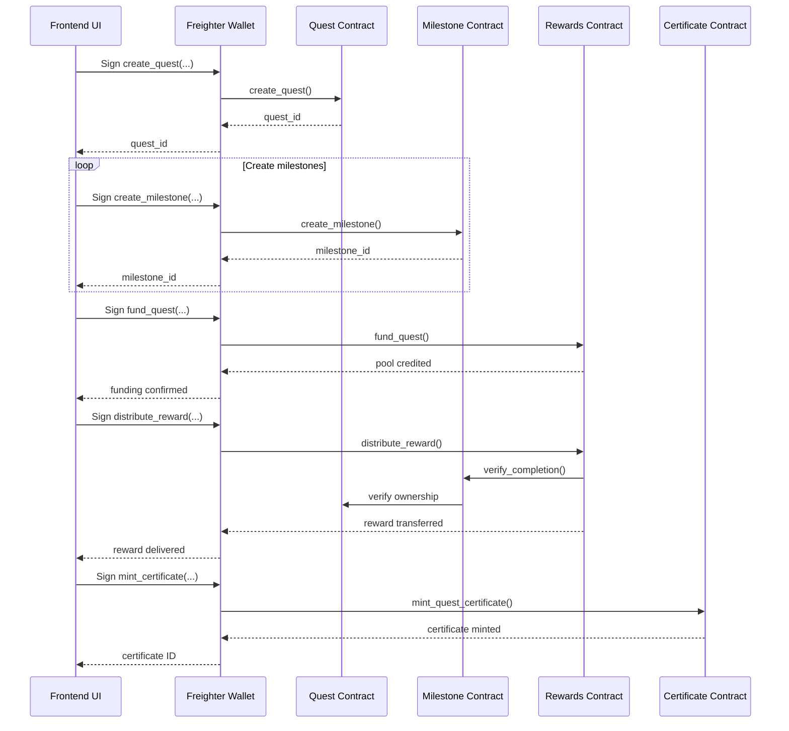

# Contract Interfaces

This document provides a reference for external integrators who need to interact with Lernza's smart contracts. It outlines the public functions, expected call patterns, TypeScript binding usage, and error handling conventions.

---
## Contracts Overview

| Contract | Purpose | Primary Interface File |
|----------|---------|------------------------|
| `quest` | Manages quests, enrollee registration, and quest metadata. | `contracts/quest/src/lib.rs` |
| `milestone` | Handles milestone creation, verification, and reward eligibility. | `contracts/milestone/src/lib.rs` |
| `rewards` | Manages reward pools, distribution, and refunds. | `contracts/rewards/src/lib.rs` |
| `certificate` | Mints NFT certificates upon quest completion. | `contracts/certificate/src/lib.rs` |

---
## Common Call Pattern

All contract calls follow the Soroban invocation model:
1. **Prepare arguments** – Encode Rust types to XDR.
2. **Sign the transaction** – Use a Stellar wallet (e.g., Freighter) to sign.
3. **Submit to the network** – Send the transaction to the Stellar testnet/mainnet.
4. **Handle the result** – Check `Result<T, Error>` for success or error codes.

---
## TypeScript Bindings

The Stellar CLI generates fully‑typed TypeScript clients located in `frontend/src/lib/contracts/generated/`. Below is a typical usage example for the `quest` contract.

```typescript
import { Client as QuestClient } from '@/lib/contracts/generated/quest';

const questClient = new QuestClient({
  networkPassphrase: 'Test SDF Network ; September 2021',
  serverUrl: 'https://horizon-testnet.stellar.org',
});

// Example: Create a quest
async function createQuest(params: {
  owner: string;
  name: string;
  description: string;
  tokenAddr: string;
}) {
  const tx = await questClient.create_quest(
    params.owner,
    params.name,
    params.description,
    params.tokenAddr,
    // ... other required args
  );
  // `tx` is a Stellar TransactionEnvelope – sign with Freighter
  const signedTx = await window.freighter.sign(tx);
  const result = await questClient.submitTransaction(signedTx);
  if (result.isErr()) {
    // All contract errors are returned as `Error` with a numeric code.
    console.error('Contract error', result.unwrapErr());
    throw new Error('Quest creation failed');
  }
  const questId = result.unwrap();
  return questId;
}
```

---
## Error Handling

Every public function returns `Result<T, Error>` where `Error` is an enum defined in the contract. The Rust source contains a table mapping each error variant to an integer code. The generated TypeScript bindings expose `error` as an object with `{ code: number; message: string }`.

| Contract | Function | Error Codes | Typical Causes |
|----------|----------|-------------|----------------|
| Quest | `create_quest` | 1: `AlreadyExists`, 2: `InvalidParameters` | Duplicate quest ID, missing required fields |
| Milestone | `create_milestone` | 3: `Unauthorized`, 4: `QuestNotFound` | Caller not quest admin, referencing unknown quest |
| Rewards | `fund_quest` | 5: `InsufficientBalance`, 6: `NotOwner` | Funding account lacks required tokens, caller not quest owner |
| Certificate | `mint_quest_certificate` | 7: `AlreadyMinted`, 8: `QuestIncomplete` | Certificate already exists, quest not fully completed |

---
## Recommended Call Flow

Below is a high‑level sequence diagram (placeholder) illustrating a typical workflow from quest creation to reward distribution.



---
## Further Reading

- [API Reference](../api-reference.md) – Complete function signatures.
- [Event Reference](../EVENT_REFERENCE.md) – All emitted events.
- [Integration Testing Guide](../INTEGRATION_TESTING.md) – How to test contracts locally.
- [Generating TypeScript Bindings](../README.md#generating-typescript-contract-bindings) – CLI steps.

*This document is versioned alongside the project. Keep it in sync with contract changes.*
