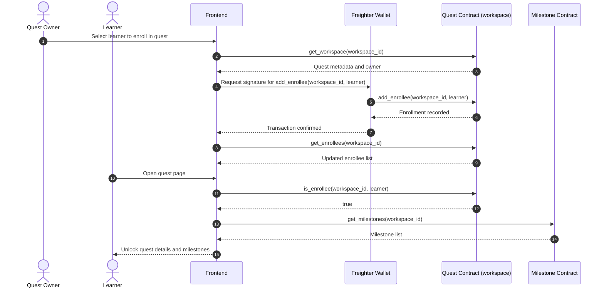

# Enrollment Flow

This flow shows the quest owner enrolling a learner, then the frontend reloading quest access and milestone data for the learner experience.

```mermaid
sequenceDiagram
    autonumber
    actor Owner as Quest Owner
    actor Learner as Learner
    participant FE as Frontend
    participant Wallet as Freighter Wallet
    participant Quest as Quest Contract (workspace)
    participant Milestone as Milestone Contract

    Owner->>FE: Select learner to enroll in quest
    FE->>Quest: get_workspace(workspace_id)
    Quest-->>FE: Quest metadata and owner
    FE->>Wallet: Request signature for add_enrollee(workspace_id, learner)
    Wallet->>Quest: add_enrollee(workspace_id, learner)
    Quest-->>Wallet: Enrollment recorded
    Wallet-->>FE: Transaction confirmed
    FE->>Quest: get_enrollees(workspace_id)
    Quest-->>FE: Updated enrollee list

    Learner->>FE: Open quest page
    FE->>Quest: is_enrollee(workspace_id, learner)
    Quest-->>FE: true
    FE->>Milestone: get_milestones(workspace_id)
    Milestone-->>FE: Milestone list
    FE-->>Learner: Unlock quest details and milestones
```
