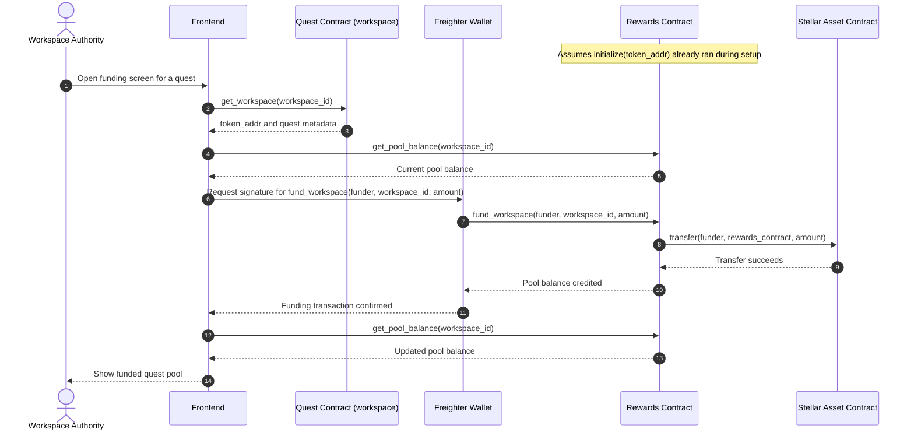

# Funding Flow

This flow shows the workspace authority funding a quest pool through the rewards contract. The rewards contract then moves tokens through the Stellar asset contract and updates the workspace pool balance.

