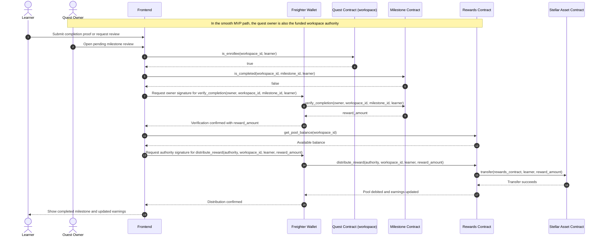

# Milestone Completion and Reward Distribution Flow

This flow shows the frontend coordinating milestone verification and reward payout as two explicit transactions. The contracts stay decoupled, and the frontend carries the workspace ID, milestone ID, learner address, and verified reward amount across steps.

