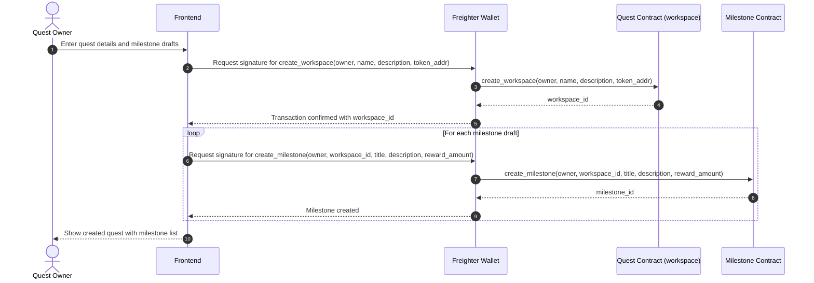

# Quest Creation Flow

This flow shows a quest owner creating a quest in the quest contract, then adding milestone definitions through the milestone contract from the same frontend flow.

```mermaid
sequenceDiagram
    autonumber
    actor Owner as Quest Owner
    participant FE as Frontend
    participant Wallet as Freighter Wallet
    participant Quest as Quest Contract (workspace)
    participant Milestone as Milestone Contract

    Owner->>FE: Enter quest details and milestone drafts
    FE->>Wallet: Request signature for create_workspace(owner, name, description, token_addr)
    Wallet->>Quest: create_workspace(owner, name, description, token_addr)
    Quest-->>Wallet: workspace_id
    Wallet-->>FE: Transaction confirmed with workspace_id

    loop For each milestone draft
        FE->>Wallet: Request signature for create_milestone(owner, workspace_id, title, description, reward_amount)
        Wallet->>Milestone: create_milestone(owner, workspace_id, title, description, reward_amount)
        Milestone-->>Wallet: milestone_id
        Wallet-->>FE: Milestone created
    end

    FE-->>Owner: Show created quest with milestone list
```
